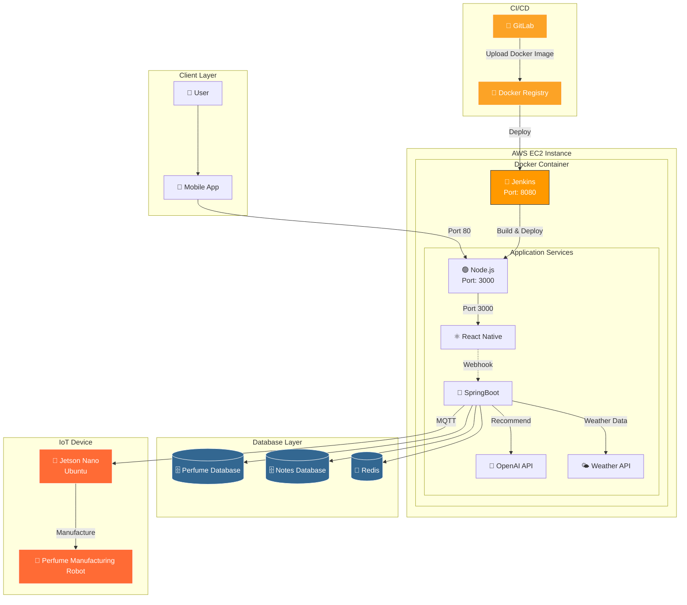

# MooDrop - AI 기반 향수 추천 및 제조 로봇

SSAFY A102 공통 프로젝트 - 임베디드 시스템 컨트롤러

## 🌟 프로젝트 개요

MooDrop은 AI 기반 향수 추천 및 자동 제조를 제공하는 스마트 향수 제조 로봇의 임베디드 제어 시스템입니다. MQTT 프로토콜을 통해 원격 제어되며, Jetson Nano 환경에서 서보모터와 밸브를 제어하여 정밀한 향수 제조를 수행합니다.

## 🔧 시스템 아키텍처

### 전체 시스템 구성도



### 하드웨어 구성
- **플랫폼**: Jetson Nano
- **PWM 컨트롤러**: PCA9685 (I2C 통신)
- **서보모터**: MG996R (회전 플레이트용, 밸브 제어용)
- **통신**: MQTT over WiFi

### 소프트웨어 모듈
- **MQTT 통신 모듈** (`mqtt.c/h`): 원격 명령 수신 및 상태 보고
- **서보 제어 모듈** (`servo.c/h`): PCA9685 PWM 컨트롤러 제어
- **밸브 제어 모듈** (`valve.c/h`): 향료 디스펜싱 제어
- **동기화 제어 모듈** (`servo_sync.c/h`): 제조 프로세스 통합 제어
- **데이터베이스 모듈** (`database.c/h`): 재고 관리 및 확인
- **LED 제어 모듈** (`led.c/h`): 상태 표시

## 🚀 주요 기능

### 1. MQTT 기반 원격 제어
- **연결 확인**: `connect` 명령으로 디바이스 상태 확인
- **제조 명령**: `manufacture` 명령으로 향수 제조 시작
- **재고 업데이트**: `update` 명령으로 향료 재고 관리
- **재고 조회**: `check` 명령으로 현재 재고 확인

### 2. 정밀 서보 제어
- **회전 플레이트**: 향료 컨테이너 위치 선택 (30도 간격)
- **밸브 제어**: 정밀한 향료 디스펜싱 (2 drop = 600ms)
- **동기화된 동작**: 위치 이동 → 밸브 개방 → 대기 순서

### 3. 안전한 제조 프로세스
- 재고 확인 후 제조 가능 여부 판단
- 단계별 상태 피드백
- 안전한 초기화 및 종료 프로세스

## 📋 MQTT 프로토콜

### 구독 토픽: `perfume/recipe`
### 발행 토픽: `perfume/feedback`

#### 지원 명령어

**1. 연결 확인**
```json
{
  "CMD": "connect"
}
```

**2. 향수 제조**
```json
{
  "CMD": "manufacture",
  "data": [
    {"num": 1, "prop": 30},
    {"num": 5, "prop": 20},
    {"num": 8, "prop": 25}
  ]
}
```
- `num`: 향료 위치 번호
- `prop`: 향료 비율 (10분위)

**3. 재고 업데이트**
```json
{
  "CMD": "update",
  "data": [
    {"num": 1, "capacity": 100},
    {"num": 5, "capacity": 80}
  ]
}
```

**4. 재고 조회**
```json
{
  "CMD": "check"
}
```

## 🔨 빌드 및 설정

### 필요한 라이브러리
- **libmosquitto-dev**: MQTT 클라이언트 라이브러리
- **libcjson-dev**: JSON 파싱 라이브러리
- **libi2c-dev**: I2C 통신 라이브러리

### 설치 명령어
```bash
sudo apt update
sudo apt install libmosquitto-dev libcjson-dev libi2c-dev
```

### 컴파일
```bash
gcc -o perfume_robot main.c mqtt.c servo.c valve.c servo_sync.c database.c led.c \
    -lmosquitto -lcjson -lpthread
```

### 실행
```bash
sudo ./perfume_robot
```

## ⚙️ 하드웨어 설정

### I2C 설정
- **I2C 버스**: `/dev/i2c-1`
- **PCA9685 주소**: `0x60`
- **PWM 주파수**: 50Hz (서보모터용)

### 서보 채널 맵핑
- **채널 0**: 회전 플레이트 서보 (SERVO_ROTATE)
- **채널 1**: 밸브 제어 서보 (SERVO_VALVE)

### 각도 설정
- **회전 플레이트**: 0-180도 (30도씩 6개 위치)
- **밸브**: 0도(닫힘) ~ 85도(열림)

## 📁 3D 모델링 파일

`3D_modeling/` 디렉토리에는 하드웨어 제작을 위한 STL 파일들이 포함되어 있습니다:

### 기어박스 부품 (`gearbox/`)
- 서보모터 가이드 플레이트
- 밸브 연결 부품
- 기어 결합 부품

### 플레이트 부품 (`plate/`)
- 10ml/30ml 용량별 컨테이너 홀더
- 암수 결합 구조의 플레이트 시스템

## 🔧 개발 및 테스트

### 테스트 파일
- `moter_control/test/servo_test.c`: C 기반 서보 테스트
- `moter_control/test/servo_test.py`: Python 기반 서보 테스트
- `moter_control/test/i2c_test.py`: I2C 통신 테스트

### 디버깅
프로그램 실행 시 상세한 로그가 콘솔에 출력됩니다:
- MQTT 연결 상태
- 명령 수신 및 파싱 결과
- 서보 동작 상태
- 제조 프로세스 진행 상황

## 📞 MQTT 브로커 설정

현재 설정된 브로커: `70.12.245.101:1883`

## ⚠️ 주의사항

1. **루트 권한 필요**: I2C 통신을 위해 `sudo` 권한으로 실행
2. **하드웨어 연결 확인**: PCA9685와 서보모터 연결 상태 확인
3. **네트워크 연결**: MQTT 브로커와의 안정적인 네트워크 연결 필요
4. **안전한 종료**: Ctrl+C로 프로그램 종료 시 MQTT 연결이 정상적으로 해제됨

## 🔄 현재 개발 브랜치

- **현재 브랜치**: `servo_spin`
- **메인 브랜치**: `master`

## 📝 최근 업데이트

- 향료 갯수 유동적 변경 기능 추가
- servo + MQTT 통합 및 모듈화
- servo_spin 최적화
- valve_ctrl 최적화
- recipe count 버그 수정